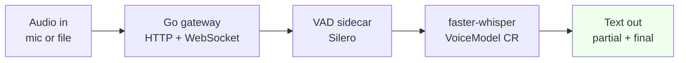

---
hide:
  - navigation
  - toc
---

# VoxPlatform

**A Kubernetes-native voice transcription platform.** Streaming speech-to-text on GKE, with a VAD sidecar, a `VoiceModel` operator that declaratively manages inference workloads, and an evaluation harness that measures WER on every change.

[Get started in 5 minutes :material-arrow-right:](tutorial/first-transcription.md){ .md-button .md-button--primary }
[View the source on GitHub :material-github:](https://github.com/abhishekkarki/voxplatform){ .md-button }

---

## What it does

- **Batch and streaming** — `POST /transcribe` for files, `WS /stream` for low-latency live audio.
- **Voice-activity detection** in front of the model so we only spend GPU/CPU cycles on speech.
- **Declarative model serving** — apply a `VoiceModel` CR and the operator reconciles a Deployment + Service for that model variant.
- **Continuous evaluation** — `jiwer`-based WER computed on a held-out dataset on every PR.

## How these docs are organised

This site follows the [Diataxis](https://diataxis.fr/) framework. Four sections, four different jobs:

-   :material-school: **[Tutorial](tutorial/index.md)**

    Learning-oriented. Start here if you've never used Vox. We'll get you from `git clone` to a live transcription in five minutes.

-   :material-tools: **[How-to guides](how-to/index.md)**

    Task-oriented. Recipes for the things you'll actually do — deploy a model, run the eval harness, scale the cluster, use the SDK.

-   :material-book-open-variant: **[Reference](reference/index.md)**

    Information-oriented. The HTTP API, the WebSocket protocol, the `VoiceModel` CRD spec, the Python SDK, the `vox` CLI. Look things up here.

-   :material-lightbulb-on: **[Explanation](explanation/index.md)**

    Understanding-oriented. Why a VAD sidecar instead of in-process VAD? Why an operator? What did we get wrong the first time? Read for context, not for instructions.

## Repository at a glance

| Component | Path | Stack |
|-----------|------|-------|
| HTTP/WS gateway | `gateway/` | Go, gorilla/websocket, Prometheus |
| VAD sidecar | `vad/` | Python, Silero |
| Model serving | Helm chart | faster-whisper |
| Operator | `operator/` | Kubebuilder, controller-runtime |
| Python SDK + CLI | `sdk/` | httpx, click |
| Evaluation | `eval/` | jiwer v4 |
| Infrastructure | `infra/` | Terraform, GKE, ArgoCD |
